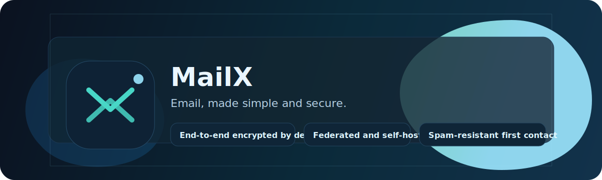

# MailX



MailX is a federated email replacement that makes one thing non-negotiable: private messages should stay private.

End-to-end encryption is the default. First-time senders do not land straight in your inbox. And you can run your own server.

Links:

- Try it now: `QUICKSTART.md`
- Demo walkthrough: `demo/README.md`
- Docs hub: `docs/index.md`
- Project website: `https://albahrani.github.io/mailx/`

## Why MailX

- Email should feel safe by default.
- Spam should not be a full-time job.
- Your address should stay simple: `name@domain`.
- You should be able to self-host without becoming a security expert.

## How It Feels

Alice sends Bob a message.

Bob sees it in Requests (because Alice is new). One explicit Accept, and the conversation continues in Inbox.

No fragile filters. No “hope the spam folder caught it”. No plaintext sitting on a server.

## Try The Demo (2 minutes)

```bash
cd demo
./setup.sh
```

Windows (PowerShell):

```powershell
cd demo
./setup.ps1
```

This starts three demo servers that can exchange encrypted messages.

Next: `demo/README.md`

## What You Get Today (Demo v0.1)

- Server + CLI client
- End-to-end encrypted messages by default
- Federation via well-known discovery
- First-contact flow (Requests -> Accept -> Inbox)

## Learn More (Without The Wall Of Text)

- Big picture: `docs/overview.md`
- Architecture: `docs/Architecture.md`
- Protocol: `docs/Protocol.md`
- Threat model (honest limitations): `docs/ThreatModel.md`
- Roadmap: `docs/Roadmap.md`

## Status and Safety

MailX is currently a demo/reference implementation.

- It is designed to be easy to read, run, and iterate on.
- It is not production-ready.

If you are evaluating it for serious use, start with: `docs/ThreatModel.md`
