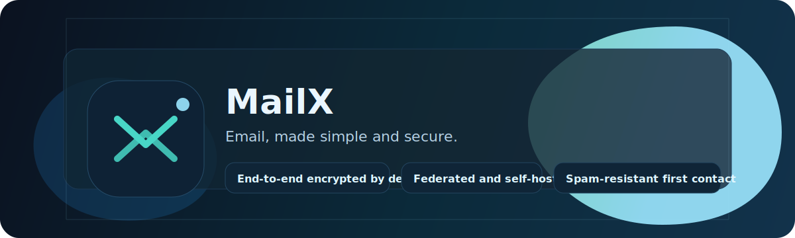

  
Demo/reference implementation

  
  <h1>Email, made simple and secure.</h1>

  
MailX is a federated email replacement built around a simple belief: private messages should stay private. End-to-end encryption is the default. First-time senders do not land straight in your inbox. And you can run your own server.

  

    <a class="btn btnPrimary" href="https://github.com/albahrani/mailx">View on GitHub</a>
    <a class="btn" href="overview/">Read the overview</a>
    <a class="btn" href="try/">Try the demo</a>
  

  

    
Private by default

    
Messages are end-to-end encrypted by default. Servers store encrypted blobs, not plaintext.

  

  

    
Spam-resistant

    
First-time senders land in Requests. One explicit accept moves the conversation to Inbox.

  

  

    
Federated and self-hostable

    
Keep the simplicity of <code>name@domain</code> while staying independent of any central provider.

  

## What You'll See

MailX is intentionally boring in the best way: it focuses on the everyday experience.

  
A simple flow

  
New sender -> Requests. One explicit accept -> Inbox. Messages stay end-to-end encrypted.

  <pre><code class="language-text">alice&gt; send bob@bob.local "Hello" "Want to try MailX?"
bob&gt; list requests
bob&gt; accept alice@alice.local
bob&gt; list inbox</code></pre>

## Start Here

- Overview (non-technical): [Overview](overview/)
- Try the demo: [Try](try/)
- Quick start: [QUICKSTART.md](https://github.com/albahrani/mailx/blob/main/QUICKSTART.md)
- Demo walkthrough: [demo/README.md](https://github.com/albahrani/mailx/blob/main/demo/README.md)

## Deep Dives

- [Architecture]({{ "/Architecture/" | relative_url }})
- [Protocol]({{ "/Protocol/" | relative_url }})
- [Threat Model]({{ "/ThreatModel/" | relative_url }})
- [Roadmap]({{ "/Roadmap/" | relative_url }})

## Safety Note

MailX is currently a demo/reference implementation and is not production-ready.
